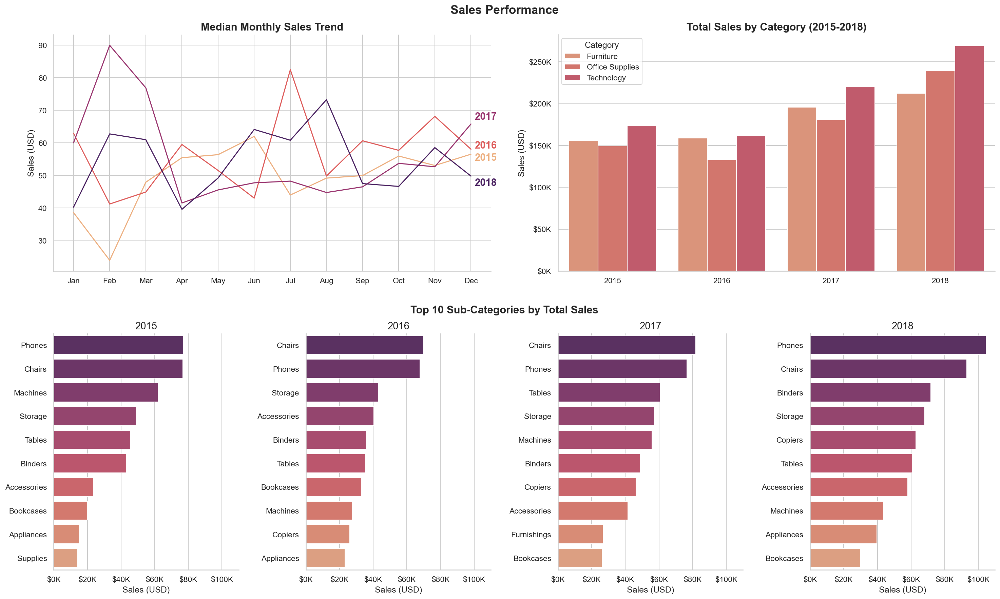
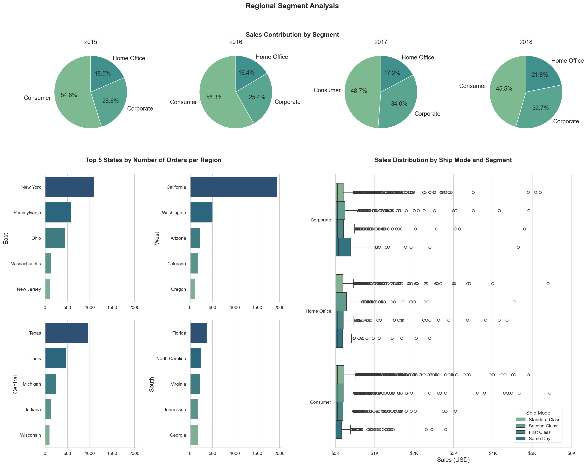

# 🛒 Superstore Sales Analysis (2015 - 2018)

## 📌 Project Overview
A data analytics project analyzing the data of 4 years in a US Superstore sales to dive deeper into the revenue trends, regional patterns, top selling products, and ship modes.

## 📌 Tools Used
Python 3.14, pandas, matplotlib, seaborn
Jupyter Notebook

## 📌 Project Structure
First_Data_Project
- data
    - train.csv
    - superstore_cleaned.csv
- 1_data_cleaning.ipynb
- 2_EDA.ipynb
- 3_visualization.ipynb
- dashboard1.png
- dashboard2.png

## 📌 Questions Answered
1. Which product categories drive the most revenue?
2. What is the median monthly sales trend from 2015-2018?
3. Which sub-categories are top sellers each year?
4. How does sales distributed by ship mode and customer segment?
5. Which states have the most orders per region?
6. How do customer segments contribute to revenue each year?

## 📌 Key Insights
- Technology is the fastest growing category (2015-2018)
- Phones and Chairs consistently being the top sub-category sales every year
- California and New York are the top ordering states
- Consumer segment dominated revenue at around 50% across all 4 years

## 📊 Dashboard Preview

## 🔎 Data Source
[Superstore Sales Dataset by Rohit Sahoo](https://www.kaggle.com/datasets/rohitsahoo/sales-forecasting )